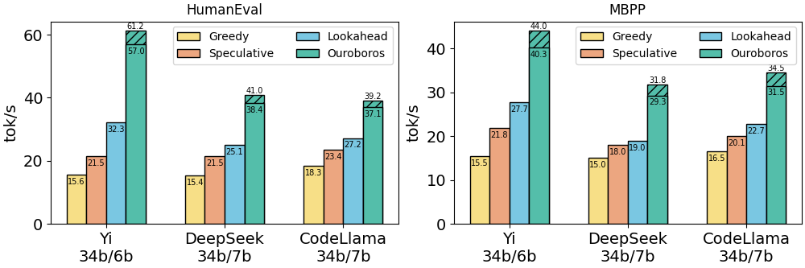

# Dual Decoding

Dual Decoding is a new decoding algorithm that has much faster generation speed compared with Speculative Decoding and Lookahead Decoding, without any training cost.


## Benchmark Result

The generation speed tested on HumanEval and MBPP are presented here. The shadowed parts are the extra improvement caused by warm start. 



Here are more experimental results on GSM8K, CNNDM and WMT16. Dual with "†" represents Dual Decoding with warm start, and Dual without "†" represents Dual Decoding without warm start.

| Task   | Algorithm   | Yi 34b/6b tok/s | Yi 34b/6b speed-up | Llama-2 70b/7b tok/s | Llama-2 70b/7b speed-up |
|--------|-------------|-----------------|----------|----------------------|----------|
|GSM8k| Greedy      | 15.33           | 1.00     | 8.96                 | 1.00     |
| GSM8k  | Speculative | 16.99           | 1.11     | 16.86                | 1.88     |
|GSM8k| Lookahead   | 25.14           | 1.64     | 13.77                | 1.54     |
|GSM8k| Dual        | 26.41           | 1.72     | 22.18                | 2.48     |
|GSM8k| Dual†       | 28.23           | 1.84     | 24.03                | 2.68     |
|CNN/DM| Greedy      | 14.62           | 1.00     | 8.12                 | 1.00     |
| CNN/DM | Speculative | 17.82           | 1.22     | 12.77                | 1.57     |
|CNN/DM| Lookahead   | 18.77           | 1.28     | 9.47                 | 1.17     |
|CNN/DM| Dual        | 21.24           | 1.45     | 14.62                | 1.80     |
|CNN/DM| Dual†       | 22.65           | 1.55     | 14.67                | 1.81     |
|WMT16| Greedy      | 14.78           | 1.00     | 9.52                 | 1.00     |
| WMT16  | Speculative | 17.48           | 1.18     | 14.72                | 1.55     |
|WMT16| Lookahead   | 17.98           | 1.22     | 14.65                | 1.54     |
|WMT16| Dual        | 19.75           | 1.34     | 19.11                | 2.01     |
|WMT16| Dual†       | 19.94           | 1.35     | 19.27                | 2.02     |


## Install

### Install from pip

```shell
pip install dualdec
```

### Install from source code

- First, clone this repo as `dualdec`
- Then, run the following command

```shell
cd dualdec
pip install -e .
```

## Quick Start

### An Example

- Here is an example of using Dual Decoding. Note: current version of `dualdec` can only support Llama model inference. Please import `LlamaForCausalLM` from `dualdec.models` instead of `transformers`

- The following code shows an example of comparing the output of Dual Decoding with Greedy decoding. If `dualdec` is installed correctly, the following code should output `True`.

```python
import torch
from dualdec import dualdec
from transformers import AutoTokenizer
from dualdec.models import LlamaForCausalLM

window_size = 20
guess_set_size = 20
lookahead_level = 7
gamma = 12

small_model = LlamaForCausalLM.from_pretrained("yourpath", torch_dtype=torch.float16, device_map='cuda')
target_model = LlamaForCausalLM.from_pretrained("yourpath", torch_dtype=torch.float16, device_map='cuda')

tokenizer = AutoTokenizer.from_pretrained("yourpath")

prompt = "Please summarize the following paragraph. Officers searched properties in the Waterfront Park and Colonsay View areas of the city on Wednesday. Detectives said three firearms, ammunition and a five-figure sum of money were recovered. A 26-year-old man who was arrested and charged appeared at Edinburgh Sheriff Court on Thursday. Summary: "

input_ids = tokenizer(prompt, return_tensors='pt').to('cuda')['input_ids']

dualdec_output = dualdec(input_ids, small_model, target_model, max_len=64, gamma=gamma, window_size=window_size, guess_set_size=guess_set_size, lookahead_level=lookahead_level)

std_output = target_model.generate(input_ids, do_sample=False, min_length=64, max_length=64)

print(dualdec_output[:,:64].equal(std_output[:,:64]))
```

### Using Dual Decoding 

- First, prepare two huggingface transformers models (the target model and draft model). Load the model with `LlamaForCausalLM` from `dualdec.models`.
- Then import the generation function `dualdec` from `dualdec`.
- Call the function by the following parameters:
```python 
@torch.no_grad()
def dualdec(prefix : torch.Tensor, approx_model : torch.nn.Module, target_model : torch.nn.Module, ngram_cache : CacheEngine = None,
                         max_len : int = 512 , gamma : int = 4, window_size = 20, guess_set_size = 20, lookahead_level = 7, eos_token_id = 2, topk=3) -> torch.Tensor:
    """
    Performs dual decoding with an approximate model and a target model to generate a sequence of tokens.

    Args:
        prefix (torch.Tensor): The initial sequence of tokens to start the generation from.
        approx_model (torch.nn.Module): The approximate model used for initial token generation. The model should support huggingface transformers model methods.
        target_model (torch.nn.Module): The target model used for refining the generated tokens. The model should support huggingface transformers model methods.
        ngram_cache (CacheEngine, optional): A cache engine for storing and retrieving n-gram predictions. Defaults to None, in which case a new cache engine is created.
        max_len (int, optional): The maximum length of the generated sequence. Defaults to 512.
        gamma (int, optional): The lookahead parameter for generation. Defaults to 4.
        window_size (int, optional): The window size used for n-gram generation. Defaults to 20. Currently, must be equal to guess_set_size.
        guess_set_size (int, optional): The size of the guess set for n-gram retrieving. Defaults to 20. Currently, must be equal to window_size.
        lookahead_level (int, optional): The level of lookahead decoding. Defaults to 7.
        eos_token_id (int, optional): The token id representing the end-of-sequence token. Defaults to 2. Should be given by tokenizer.eos_token_id.
        topk (int, optional): The k of verifying k candidate suffixes.

    Returns:
        torch.Tensor: The generated sequence of tokens, including the initial prefix and any additional tokens generated by the function.
    """
```

## Citation

Please cite our [paper](TODO) if you find our work valuable.

```
@article{dualdecoding,
  title={Dual Decoding: Speculative Decoding with Large Model Enhanced Drafting},
  author={Weilin Zhao, Yuxiang Huang, Xu Han, Chaojun Xiao, Zhiyuan Liu, Maosong Sun},
  journal={arXiv preprint arXiv:TODO},
  year={2024}
}
```


